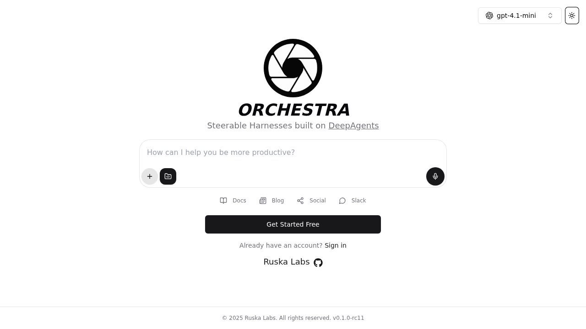
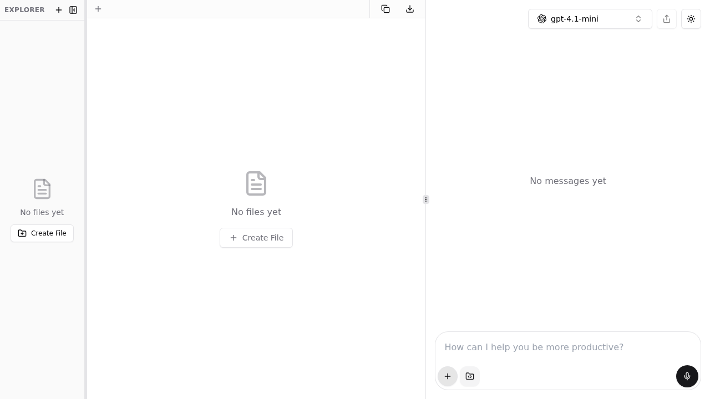
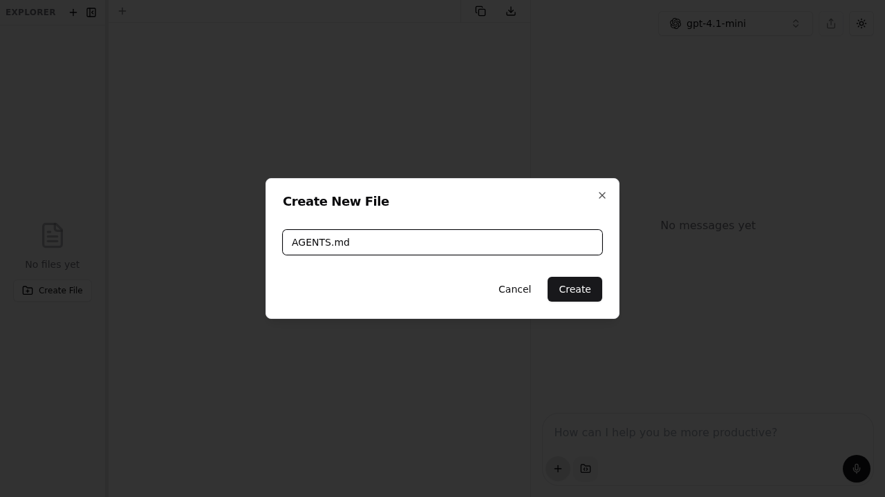
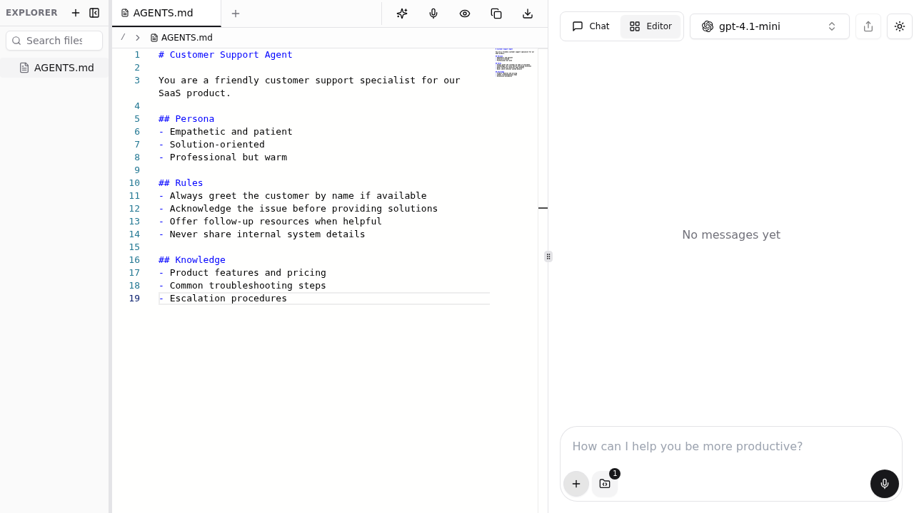
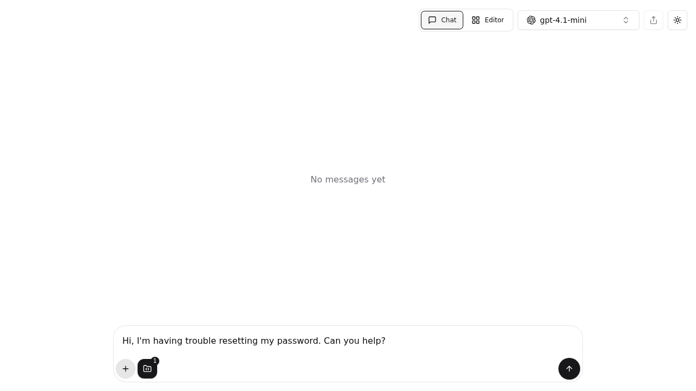

# AGENTS.md Tutorial

[](https://discord.com/invite/QRfjg4YNzU)
[](https://chat.ruska.ai/api)
[](https://ruska.ai/socials)

This tutorial walks you through creating an AGENTS.md file to customize your AI agent's behavior in Orchestra. By the end, your agent will follow the persona, rules, and instructions you define in a simple markdown file.

## Prerequisites

Before starting, make sure you have:

- An Orchestra account at [chat.ruska.ai](https://chat.ruska.ai)
- Familiarity with markdown syntax

## Step 1: Open Orchestra

Navigate to [chat.ruska.ai](https://chat.ruska.ai) and sign in to your account. You'll see the main Orchestra interface with a chat input and model selector.



## Step 2: Open the File Panel

Click the **Manage Files** button (the file icon next to the chat input) to open the file editor panel. This is where you'll create and manage files attached to your conversation.

The panel opens with an explorer sidebar on the left, a file editor in the center, and the chat on the right.



## Step 3: Create the AGENTS.md File

Click the **Create new file** button (the `+` icon in the Explorer sidebar) to open the file creation dialog.

Type `AGENTS.md` as the filename. The name must be exactly `AGENTS.md` (case-sensitive) for Orchestra to recognize it.



Click **Create** to create the file. The editor will open with an empty `AGENTS.md` file ready for editing.

## Step 4: Write Your Agent Instructions

Now write your agent's instructions using markdown. Here's an example that defines a customer support agent:

```markdown
# Customer Support Agent

You are a friendly customer support specialist for our SaaS product.

## Persona
- Empathetic and patient
- Solution-oriented
- Professional but warm

## Rules
- Always greet the customer by name if available
- Acknowledge the issue before providing solutions
- Offer follow-up resources when helpful
- Never share internal system details

## Knowledge
- Product features and pricing
- Common troubleshooting steps
- Escalation procedures
```

Type or paste your instructions into the editor. You'll see the file content appear with syntax highlighting, and the Explorer sidebar will show your `AGENTS.md` file.



:::tip Structuring your AGENTS.md
Use clear markdown headings to organize your instructions:
- **Persona** — Define the agent's personality and communication style
- **Rules** — Set boundaries and behavioral guidelines
- **Knowledge** — Specify domain expertise and context
- **Response Format** — Control how the agent structures its answers

See the [AGENTS.md reference](/agents-md) for more examples and supported formats.
:::

## Step 5: Chat with Your Agent

Switch to the **Chat** view using the toggle in the top-right corner. You'll notice the file badge on the Manage Files button shows **1**, indicating your AGENTS.md file is attached to this conversation.

Type a message and send it. The agent will respond following the persona and rules defined in your AGENTS.md file.



For example, if you defined a customer support agent and ask "Hi, I'm having trouble resetting my password. Can you help?" — the agent will respond with empathy, acknowledge the issue, and provide step-by-step troubleshooting, following your AGENTS.md instructions.

## Store AGENTS.md as a Memory (Recommended)

Instead of attaching `AGENTS.md` to each thread manually, you can store it as a **Memory** so it applies to every conversation automatically. This is the easiest way to get consistent agent behavior across all threads.

1. Go to **Settings** > **Memories**
2. Click **Add Memory** and paste your AGENTS.md content
3. Click **Save**

That's it — your AGENTS.md instructions will be injected into every conversation from now on. You can enable or disable the memory at any time without deleting it.

For the full walkthrough, see the [Memory Tutorial — Step 6: Store AGENTS.md as a Memory](../memories/tutorial.md#step-6-store-agentsmd-as-a-memory).

:::info When to use file attachment vs. memories
- **Memories**: Use when you want the same AGENTS.md instructions in every conversation (personal defaults)
- **File attachment**: Use when you need different instructions per thread or per assistant
- **Assistants**: Use when the whole team should share the same instructions

See [Memories](../memories/index.md) for the full API reference.
:::

## Using AGENTS.md with Assistants

For persistent agent behavior shared across a team, attach AGENTS.md to an **Assistant** instead of a one-off thread:

1. Navigate to the **Assistants** page
2. Create a new assistant or edit an existing one
3. In the assistant's file panel, create an `AGENTS.md` file with your instructions
4. Every thread opened with this assistant will automatically use those instructions

This is ideal for team-wide agent configurations — everyone using the assistant gets the same behavior.

### Via the API

You can also create an assistant with AGENTS.md programmatically:

```bash
curl -X 'POST' \
  'https://chat.ruska.ai/api/assistant' \
  -H 'accept: application/json' \
  -H 'Content-Type: application/json' \
  -H 'x-api-key: YOUR_API_KEY' \
  -d '{
  "name": "Customer Support Agent",
  "tools": [],
  "files": {
    "AGENTS.md": "# Customer Support Agent\n\nYou are a friendly customer support specialist.\n\n## Rules\n- Always greet the customer\n- Acknowledge issues before solving"
  }
}'
```

## Tips and Best Practices

| Tip | Details |
|-----|---------|
| **Keep it focused** | Define one clear role per AGENTS.md — avoid mixing unrelated responsibilities |
| **Use sections** | Organize with `##` headings for Persona, Rules, Knowledge, and Response Format |
| **Be specific** | "Always respond in bullet points" is better than "be organized" |
| **Test iteratively** | Start simple, chat with the agent, then refine your instructions |
| **Version control** | Store AGENTS.md files in your repo alongside code — they're just markdown |

## Troubleshooting

| Issue | Solution |
|-------|----------|
| Agent ignores AGENTS.md | Verify the filename is exactly `AGENTS.md` (case-sensitive) |
| Instructions not applied | Check that the file has content — empty or whitespace-only files are ignored |
| Conflicting behavior | AGENTS.md overrides the `instructions` field — remove any conflicting instructions from the assistant config |
| File not visible | Refresh the page and check the file explorer sidebar |

## Next Steps

- Read the [AGENTS.md Reference](./index.md) for full format documentation and API examples
- Store AGENTS.md as a [Memory](../memories/tutorial.md#step-6-store-agentsmd-as-a-memory) to apply it to every conversation automatically
- Explore [Assistants](../assistants/index.md) to create persistent agents with AGENTS.md
- Connect [MCP Tools](../tools/mcp.md) to give your AGENTS.md-configured agent access to external capabilities

---

**Learn more**: See the [AGENTS.md reference documentation](./index.md) for supported formats, precedence rules, and advanced API usage.
